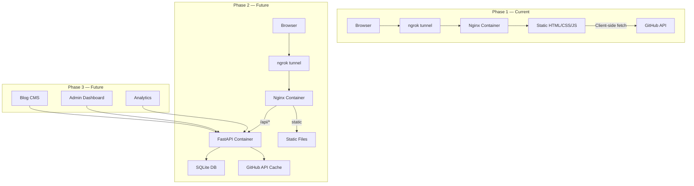

# Portfolio Website — Nishad Anil

A modern, premium portfolio website showcasing **40 GitHub repositories** organized by category (AI/ML, RAG, Agentic AI, DevOps, etc.) with filterable project cards. Served via **Nginx in Docker**, exposed through **ngrok**, and architected for phased evolution from static frontend → FastAPI backend → SQLite database.

---

## User Review Required

> [!IMPORTANT]
> **Phase 1 is frontend-only** (no backend). Projects will be fetched **client-side via the GitHub API** at load time. This means the page makes live API calls to `api.github.com`. GitHub's unauthenticated rate limit is **60 requests/hour per IP**. This is fine for personal use and demo, but Phase 2's backend will cache data server-side to remove this limitation.

> [!WARNING]
> **Ngrok free tier** generates a random URL on each restart. If you need a stable URL, you'll need an ngrok account with a reserved domain (free tier includes 1 static domain). We'll configure Docker Compose to handle this.

---

## Open Questions

> [!IMPORTANT]
> 1. **About Me content**: Do you want to provide your bio text, or should I write a placeholder based on your GitHub profile ("AI/ML Engineer with expertise in RAG, Agentic AI, and DevOps")?
> 2. **Experience & Education**: Can you share your work experience and education details, or should I use placeholder content that you'll fill in later?
> 3. **Profile photo**: Do you have a headshot/photo you'd like to use, or should I use your GitHub avatar?
> 4. **Color scheme preference**: Any brand colors you prefer, or should I design a modern dark theme with accent colors that match the AI/ML space?

---

## Proposed Changes

### Architecture Overview



---

## Phase 1: Static Frontend + Docker + Nginx + Ngrok *(Current Sprint)*

### Project Structure

```
Portfolio/
├── frontend/
│   ├── index.html              # Main SPA entry point
│   ├── css/
│   │   ├── index.css           # Design system tokens & utilities
│   │   ├── components.css      # Component styles
│   │   └── animations.css      # Micro-animations & transitions
│   ├── js/
│   │   ├── app.js              # Main application logic
│   │   ├── github.js           # GitHub API integration
│   │   ├── projects.js         # Project filtering & rendering
│   │   ├── animations.js       # Scroll animations & interactions
│   │   └── navigation.js       # Smooth scroll & nav behavior
│   └── assets/
│       ├── images/             # Icons, logos, backgrounds
│       └── fonts/              # Custom fonts (if any)
├── nginx/
│   └── nginx.conf              # Nginx configuration
├── docker/
│   └── Dockerfile              # Multi-stage Docker build
├── docker-compose.yml          # Service orchestration
├── docker-compose.dev.yml      # Dev overrides (ngrok)
├── .env.example                # Environment template
├── Makefile                    # Convenience commands
├── README.md                   # Project documentation
└── decisions/                  # Decision & task tracking
    ├── README.md               # Decisions folder overview
    ├── 001-architecture.md     # Architecture decisions
    ├── 002-phase1-tasks.md     # Phase 1 task tracker
    ├── 003-phase2-plan.md      # Phase 2 plan (backend)
    └── 004-phase3-plan.md      # Phase 3 plan (CMS/blog)
```

---

### [NEW] Frontend

#### [NEW] [index.html](file:///Users/anil/Desktop/projects/Portfolio/frontend/index.html)
Single-page application with sections:
- **Hero Section**: Full-viewport animated hero with name, title, tagline, CTA buttons
- **About Me**: Bio card with GitHub stats integration, profile image
- **Skills/Tech Stack**: Categorized skill badges (AI/ML, Cloud, DevOps, Languages, Frameworks)
- **Projects**: Filterable grid of project cards fetched from GitHub API
  - Categories: `AI/ML`, `RAG`, `Agentic AI`, `DevOps/CI-CD`, `Web Development`, `NLP`, `Data Science`
  - Each card shows: name, description, language badge, stars, last updated, GitHub link
  - Filter buttons for category switching with smooth transitions
- **Experience**: Timeline layout for work history
- **Education**: Cards layout for education history
- **Contact**: Contact form (frontend only in Phase 1, sends via mailto: or formspree)
- **Footer**: Social links, copyright

#### [NEW] [index.css](file:///Users/anil/Desktop/projects/Portfolio/frontend/css/index.css)
Design system with:
- CSS custom properties for colors, typography, spacing, shadows
- Dark theme as default with sleek gradients (deep navy → purple → cyan accents)
- Responsive grid system
- Google Fonts: Inter (body), JetBrains Mono (code elements)

#### [NEW] [components.css](file:///Users/anil/Desktop/projects/Portfolio/frontend/css/components.css)
- Project card component with glassmorphism effect
- Skill badges with gradient borders
- Navigation bar with backdrop blur
- Timeline component for experience section
- Animated section transitions

#### [NEW] [animations.css](file:///Users/anil/Desktop/projects/Portfolio/frontend/css/animations.css)
- Scroll-triggered fade-in/slide-up animations
- Gradient background animation on hero
- Card hover effects (lift, glow, border animation)
- Smooth filter transitions for project grid
- Loading skeleton states

#### [NEW] [github.js](file:///Users/anil/Desktop/projects/Portfolio/frontend/js/github.js)
- Fetch all repos from `https://api.github.com/users/anilnishad19799/repos?per_page=100`
- Fetch user profile from `https://api.github.com/users/anilnishad19799`
- Intelligent category mapping based on repo names and topics
- Cache results in `localStorage` with TTL to reduce API calls
- Graceful fallback to hardcoded data if API is rate-limited

#### [NEW] [projects.js](file:///Users/anil/Desktop/projects/Portfolio/frontend/js/projects.js)
- Render project grid with dynamic filtering
- Category filter buttons with active state
- Search functionality across project names/descriptions
- Sort by: recently updated, stars, name
- Responsive masonry-like layout

#### [NEW] [app.js](file:///Users/anil/Desktop/projects/Portfolio/frontend/js/app.js)
- Initialize all modules
- Smooth scrolling navigation
- Active section highlighting in nav
- Mobile menu toggle
- Theme initialization

#### [NEW] [animations.js](file:///Users/anil/Desktop/projects/Portfolio/frontend/js/animations.js)
- Intersection Observer for scroll animations
- Staggered card entrance animations
- Counter animations for GitHub stats
- Parallax effects on hero section

#### [NEW] [navigation.js](file:///Users/anil/Desktop/projects/Portfolio/frontend/js/navigation.js)
- Smooth scroll to sections
- Sticky navbar with scroll-aware styles
- Mobile hamburger menu
- Active section tracking

---

### [NEW] Docker & Infrastructure

#### [NEW] [Dockerfile](file:///Users/anil/Desktop/projects/Portfolio/docker/Dockerfile)
```dockerfile
# Simple Nginx-based image serving static files
FROM nginx:alpine
COPY nginx/nginx.conf /etc/nginx/conf.d/default.conf
COPY frontend/ /usr/share/nginx/html/
EXPOSE 80
```

#### [NEW] [nginx.conf](file:///Users/anil/Desktop/projects/Portfolio/nginx/nginx.conf)
- Serve static files from `/usr/share/nginx/html`
- Gzip compression enabled
- Cache headers for assets
- **Prepared `location /api/` block** (commented out) for Phase 2 reverse proxy to FastAPI
- Security headers (X-Frame-Options, CSP, etc.)
- SPA fallback: route all paths to `index.html`

#### [NEW] [docker-compose.yml](file:///Users/anil/Desktop/projects/Portfolio/docker-compose.yml)
```yaml
services:
  web:
    build:
      context: .
      dockerfile: docker/Dockerfile
    ports:
      - "8080:80"
    volumes:
      - ./frontend:/usr/share/nginx/html:ro  # Dev hot-reload
    restart: unless-stopped

  # Phase 2: Uncomment when backend is ready
  # api:
  #   build:
  #     context: .
  #     dockerfile: docker/Dockerfile.api
  #   ports:
  #     - "8000:8000"
  #   environment:
  #     - DATABASE_URL=sqlite:///data/portfolio.db
  #   volumes:
  #     - ./data:/app/data

  ngrok:
    image: ngrok/ngrok:latest
    restart: unless-stopped
    command: ["http", "web:80"]
    environment:
      - NGROK_AUTHTOKEN=${NGROK_AUTHTOKEN}
    ports:
      - "4040:4040"  # Ngrok dashboard
    depends_on:
      - web
```

#### [NEW] [.env.example](file:///Users/anil/Desktop/projects/Portfolio/.env.example)
```env
NGROK_AUTHTOKEN=your_ngrok_auth_token_here
# Phase 2
# GITHUB_TOKEN=your_github_personal_access_token
# DATABASE_URL=sqlite:///data/portfolio.db
```

#### [NEW] [Makefile](file:///Users/anil/Desktop/projects/Portfolio/Makefile)
Convenience commands:
- `make dev` — Start with docker-compose (dev mode with volume mount)
- `make prod` — Build and start production containers
- `make ngrok` — Start with ngrok tunnel
- `make stop` — Stop all containers
- `make logs` — View container logs
- `make clean` — Remove containers and images

---

### [NEW] Decisions & Tracking

#### [NEW] [decisions/README.md](file:///Users/anil/Desktop/projects/Portfolio/decisions/README.md)
Overview of the decisions folder structure, how to use it for context management.

#### [NEW] [decisions/001-architecture.md](file:///Users/anil/Desktop/projects/Portfolio/decisions/001-architecture.md)
Architecture Decision Record:
- **Stack**: HTML/CSS/JS → Nginx → Docker → ngrok
- **Phase 1**: Static frontend, client-side GitHub API
- **Phase 2**: FastAPI backend, SQLite, server-side caching
- **Phase 3**: Blog CMS, admin dashboard, analytics
- **Rationale**: Keep Phase 1 simple, zero dependencies; backend adds value only when CMS/caching needed

#### [NEW] [decisions/002-phase1-tasks.md](file:///Users/anil/Desktop/projects/Portfolio/decisions/002-phase1-tasks.md)
Phase 1 task tracker with checkboxes for:
- Design system creation
- Hero section implementation
- About Me section
- Skills section
- Project grid + GitHub API integration
- Experience & Education sections
- Contact section
- Docker setup
- Nginx configuration
- Ngrok integration
- Testing & polish

#### [NEW] [decisions/003-phase2-plan.md](file:///Users/anil/Desktop/projects/Portfolio/decisions/003-phase2-plan.md)
Phase 2 future planning:
- FastAPI backend with SQLite
- GitHub API caching (server-side, hourly refresh)
- Contact form backend (store submissions + send email)
- Admin authentication (JWT)
- Project CRUD API (add/edit/delete/reorder projects)
- Visitor analytics endpoint

#### [NEW] [decisions/004-phase3-plan.md](file:///Users/anil/Desktop/projects/Portfolio/decisions/004-phase3-plan.md)
Phase 3 future planning:
- Blog/articles with Markdown support
- Admin CMS dashboard
- Full visitor analytics dashboard
- SEO optimization with server-side rendering
- Custom domain + HTTPS via ngrok

---

## Project Category Mapping

Based on your 40 repositories, here's the proposed categorization:

| Category | Repositories |
|---|---|
| **🤖 AI/ML** | End-to-End_Image_classification_MLFLOW, MLflow, peft-lora-llm-finetuning, Testing_Stable_Diffusion, Research_Paper_Implement |
| **🔗 RAG** | Advanced-RAG, GraphRAG, LightRAG, MultiDomainRAG, Vectorless_RAG, realtime-rag-pipeline |
| **🤖 Agentic AI** | agent-memory-system-langgraph, agentic-ai-guardrails, AI-Powered-Code-Review-Agent-System, Langgraph, Claude_MCP_server, MCP_server, AI-Driven_Engineering |
| **☁️ Cloud/DevOps** | aws_end_to_end, Floci_AWS, CICD_YT, fastapi-cicd-demo, DVC-DataVersioning |
| **🌐 Web Development** | Full_Stack_Learning, ImagetoText_Django_HuggingFace, DxFactor |
| **📝 NLP** | Basic_NLP |
| **💻 Programming** | basicpython, DSA, DSAPython |

> [!TIP]
> Categories will be auto-detected from repo names and descriptions, with a fallback to this manual mapping. You can customize categories later.

---

## Verification Plan

### Automated Tests
```bash
# Build and run Docker containers
make dev

# Verify Nginx is serving correctly
curl -I http://localhost:8080

# Verify ngrok tunnel is active
curl http://localhost:4040/api/tunnels

# Validate HTML structure
npx html-validate frontend/index.html
```

### Manual Verification
- Open `http://localhost:8080` and verify all sections render correctly
- Test project filtering across all categories
- Test responsive design at mobile/tablet/desktop breakpoints
- Verify GitHub API integration loads repos correctly
- Test ngrok tunnel URL in an incognito browser
- Verify all animations and hover effects work smoothly
